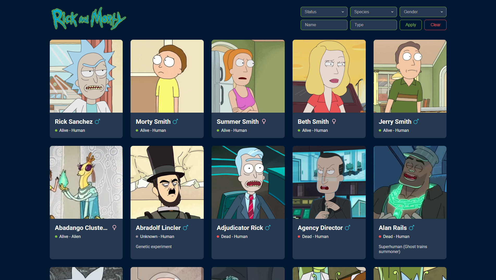
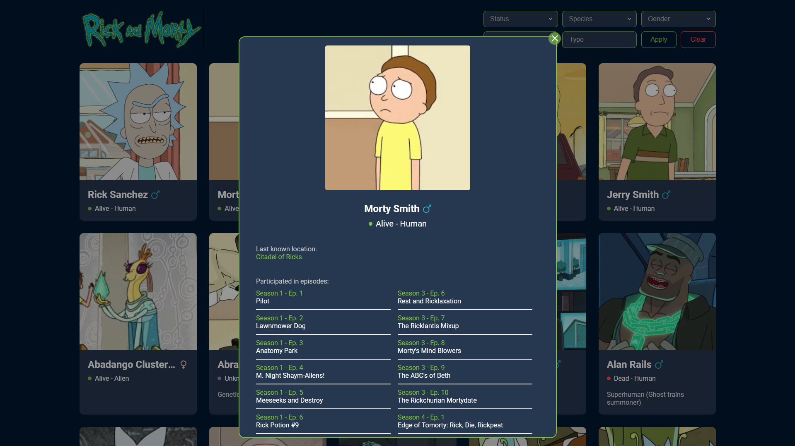
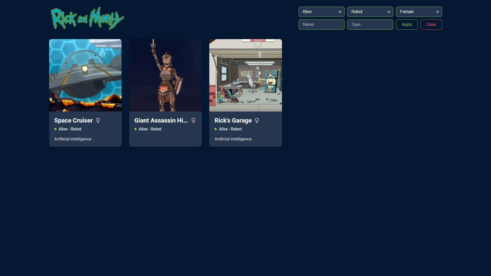
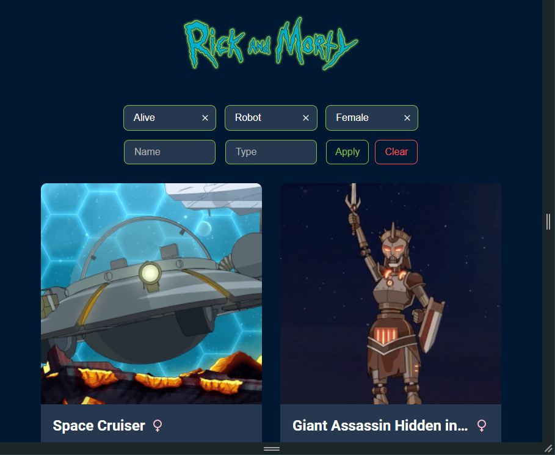
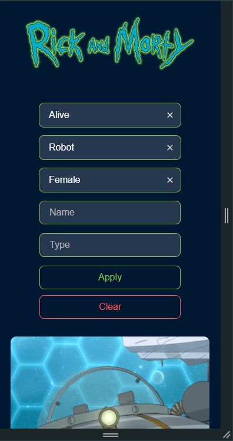

# Elfsight-test-task
тестовое задание в компанию Elfsight
## Что бы запустить приложение
1. установите зависимости <code>npm install</code>
2. запустите приложение на локальном хосте <code>npm start</code>
## Демо скриншоты 

----

----

----

----

